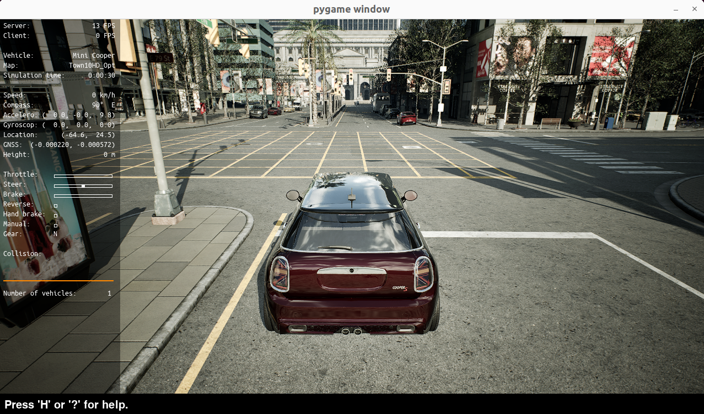
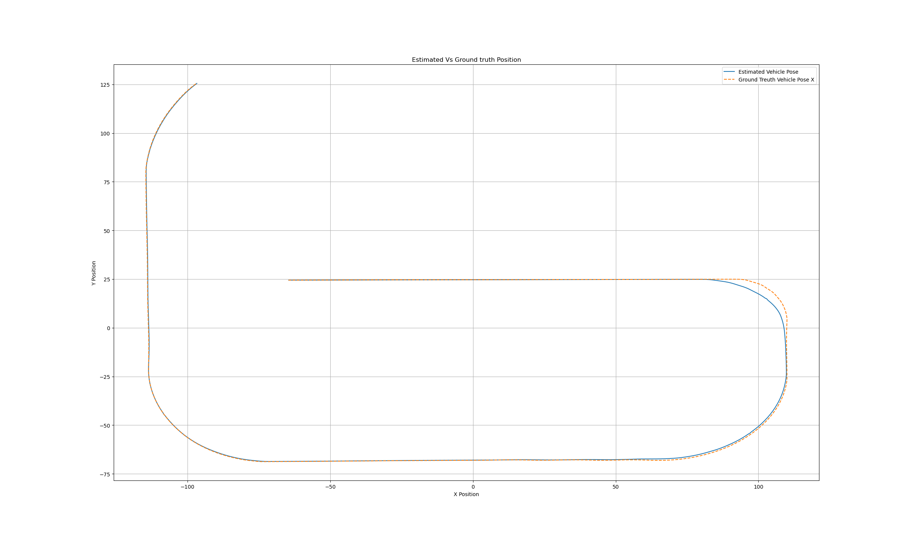

# VD State Estimation

This repository contains code for **real-time motion planning and state estimation** of an autonomous vehicle using the **CARLA simulator** and **ROS 2**.

It integrates:
- CARLA simulation and vehicle control
- ROS 2 state estimation pipeline
- Sensor interface and bag recording
- Vehicle client using `pygame`

---

## 📥 Clone the Repository

```bash
git clone https://github.com/SwatiShirke/VD_State_Estimate.git
cd VD_State_Estimation
```

---

## 🛠️ Prerequisites

- CARLA Simulator 0.10.0
- ROS 2 (e.g., Humble or Foxy)
- Python 3.8+
- Required packages: `pygame`, `numpy`, `scipy`, `rclpy`, `geometry_msgs`, `sensor_msgs`, etc.

---

## 🚀 How to Use

### 1. Start CARLA Server from a directory, where Carla is installed on your machine

From the CARLA installation directory:

```bash
cd carla_sim10/Carla-0.10.0-Linux-Shipping/
source ./CarlaUnreal.sh --ROS2
```

---

### 2. Run the CARLA client (spawns vehicle using pygame)

```bash
cd src/VD_State_Estimate/carla_client/
python3 launch_carla_client.py
```

---

### 3. Launch simulator, controller, and rosbag nodes

```bash
cd ../..
source install/setup.bash
ros2 launch vd_sim sim_launch.py
```

---

### 4. Launch the state estimator node

```bash
ros2 launch vd_state_estimate state_estimator_launch.py
```

---

## 📁 Directory Overview

```
VD_State_Estimation/
├── carla_client/                   # Pygame-based client for vehicle spawn/control
├── src/
│   └── VD_State_Estimate/         # ROS2 nodes for state estimation
    └── launch/
        └──state_estimator_launch.py
├── vd_sim
    └── launch/                         # ROS2 launch files
├──     └── sim_launch.py                   # Launches Simulator + MPC controller + bag recording launcher
└── README.md
```

---

## 📊 Results

### Estimated vs Ground Truth Trajectory



### Estimation Error Over Time



---

## 📌 Notes

- Ensure ROS 2 environment is built and sourced before launching.
- Sensor models and vehicle dynamics can be tuned in config files.
- ROS 2 bag is used to save ground truth and estimator data for evaluation.

---

## 📧 Contact

For questions, issues, or contributions, feel free to open an issue or a pull request.

---